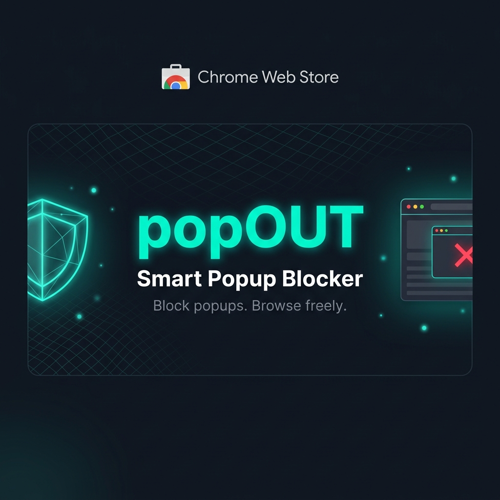

# 🛡️ popOUT - Ultimate Popup & Privacy Shield for Google Chrome



**popOUT** is an all-in-one, ultra-lightweight, and privacy-focused Chrome Extension (Manifest V3) built to automatically block unwanted pop-up windows, pop-unders, automatic script redirections, intrusive **Cookie & GDPR Consent Overlays**, **Anti-AdBlock Modals**, **Push Notification Prompt Requests**, **URL Trackers**, and **Canvas Fingerprinting**.

---

## ✨ Complete Feature Matrix

- **⚡ Main World Interception**: Safely overrides `window.open` directly in the page execution context at `document_start` to intercept unauthorized popup attempts without breaking core website functionality.
- **🍪 Auto Cookie & GDPR Overlay Blocker**: Dynamic `MutationObserver` engine that detects and automatically removes screen-blocking cookie consent dialogs (Google FC, OneTrust, Didomi, Quantcast, etc.) and restores body scrolling.
- **🚫 Anti-AdBlock Paywall Killer**: Detects and neutralizes "Please disable your AdBlocker" modal overlays and backdrop lockouts.
- **🔔 Push Notification Auto-Muter**: Automatically suppresses unwanted browser notification prompts (*"Allow notifications"* dialogs).
- **🔗 URL Tracker Parameter Stripper**: Cleans privacy-invasive tracking URL parameters (`utm_source`, `fbclid`, `gclid`, `msclkid`, etc.) automatically upon page navigation.
- **🎨 Canvas Anti-Fingerprint Shield**: Adds invisible noise to Canvas `toDataURL` calls to protect your browser identity against fingerprinting scripts.
- **🧹 Reset Stored Site Consents & Cookies**: One-click action in the popup dashboard to completely wipe stored Cookies, LocalStorage, IndexedDB, and past GDPR consent choices for the active website with an automatic page reload.
- **⚙️ Full Management Dashboard (Options Page)**: Dedicated settings tab to search, add, or remove Whitelisted & Blacklisted domains, plus full **JSON Import/Export** functionality.
- **🎨 Glassmorphism Dark UI**: Designed according to modern aesthetic standards with smooth CSS transitions, custom typography (*Plus Jakarta Sans*), neon badge pulse indicators, and dark glassmorphic cards.
- **🤖 Smart Heuristic Overlay Scanner**: Automatically detects and closes intrusive page overlays based on DOM heuristics — viewport coverage percentage, high z-index stacking, and keyword detection in element text.
- **⌨️ Keyboard Shortcut Support**: Use `Alt+Shift+P` to instantly reset site data from any page without opening the popup. Registered via Chrome Commands API.
- **📊 Data & Time Saved Insights**: The popup dashboard now shows estimated **megabytes of data** and **seconds of browsing time** saved based on total blocked popup and overlay count.

---

## 📁 Project Architecture

```
popOUT/
├── manifest.json              # Extension Manifest V3 metadata, permissions & options_ui
├── background/
│   └── service_worker.js      # Background service worker managing tab states, badges & site data wiping
├── content/
│   ├── injected.js            # Main world script (window.open, notifications, canvas fingerprint protection)
│   └── content.js             # Isolated content script (GDPR overlays, Anti-AdBlock, URL tracker stripper)
├── popup/
│   ├── popup.html             # Extension dashboard layout (Full feature toggles & options link)
│   ├── popup.css              # Glassmorphic dark design system, neon pulse animations & grid layout
│   └── popup.js               # Control panel UI logic & Chrome API event handlers
├── options/
│   ├── options.html           # Full Options page for Whitelist/Blacklist management
│   ├── options.css            # Options page layout stylesheet
│   └── options.js             # Whitelist/Blacklist logic & JSON Import/Export handler
├── assets/
│   ├── icon16.png             # 16x16 Extension Icon
│   ├── icon48.png             # 48x48 Extension Icon
│   ├── icon128.png            # 128x128 Extension Icon
│   └── promo_banner.png       # 1280x800 Chrome Web Store Promotional Banner
├── scripts/
│   └── build_zip.js           # Node.js script to package extension for Chrome Web Store release
└── README.md                  # Comprehensive project documentation
```

---

## 🛠️ Installation & Testing Guide

1. Clone or download this repository to your local computer.
2. Open **Google Chrome** and navigate to `chrome://extensions/`.
3. Enable **Developer mode** using the toggle in the top right corner.
4. Click **Load unpacked** (Paketlenmemiş öge yükle).
5. Select the `popOUT` project directory.

### Feature Verification:
1. **Popup Window Blocking**: Open `https://example.com`, open Console (`F12`), and run `window.open("https://google.com")`. The popup will be intercepted and listed in the extension popup dashboard.
2. **Cookie & Overlay Blocking**: Visit sites with invasive consent dialogs or Anti-AdBlock popups. They will be automatically removed.
3. **Reset Stored Site Consents**: Click **"Reset Stored Site Consents & Cookies"** in the popup panel to wipe site data.
4. **Options Page**: Click the **⚙️ Gear Icon** in the top header of the popup to open the full Options Manager.
5. **Smart Heuristic Scanner**: Visit a page with a cookie/overlay modal. The heuristic engine will auto-detect and close it based on viewport coverage and z-index analysis.
6. **Keyboard Shortcut**: On any page press `Alt+Shift+P` to instantly reset site data for the active domain.
7. **Insights Dashboard**: After blocking some popups, open the extension popup to see **Data Saved** (MB) and **Time Saved** (seconds) metrics.

---

## 📦 Building for Release

To package the extension as a `.zip` file ready for Chrome Web Store submission, run:

```bash
node scripts/build_zip.js
```

This produces `popOUT-v1.3.0.zip` in the root directory, containing only the necessary extension files (excludes `.git`, `docs`, `scripts`, `.superpowers`).

---

## 📄 License

This project is licensed under the [MIT License](LICENSE).
